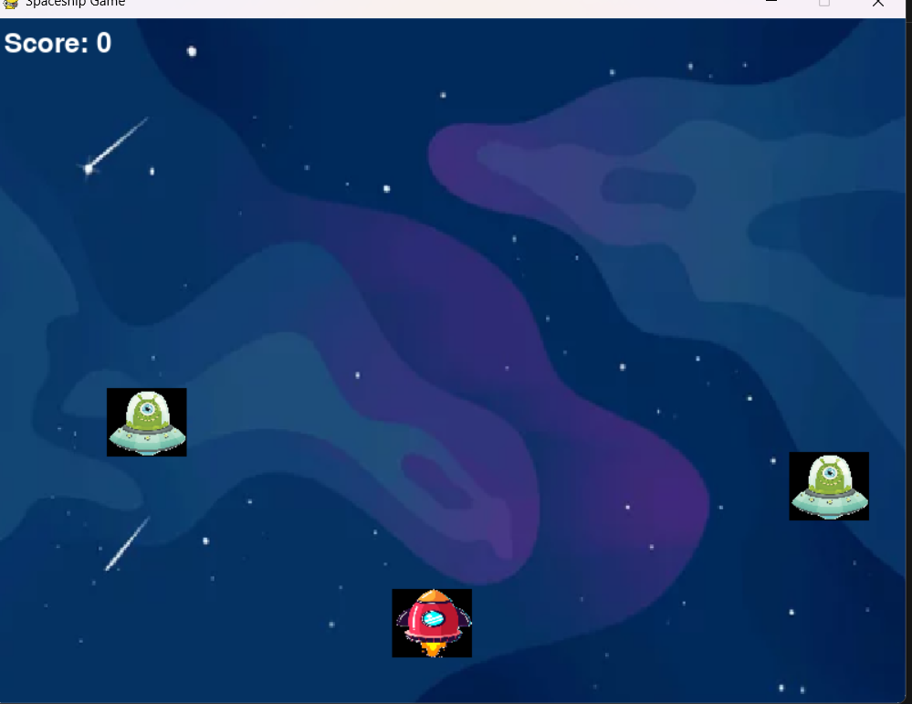

# Galactic-Battles
<h2>Basic Information:</h2>
<h3>Game Title:</h3><h4>Galactic Battles</h4>
<h3>Description:</h3><h4>Galactic Battles is a fast-paced arcade shooter where players control a spaceship to defend against relentless waves of alien invaders. Dodge incoming asteroids and unleash firepower to destroy enemy ships</h4>
<h3>Controls:</h3> 
<h4>Move: Left/Right arrow keys 
Shoot: Spacebar</h4>
<h3>Installation Instructions: </h3>
<h4>Python: Ensure you have Python installed on your system. You can download it from <a href="https://www.python.org/.">https://www.python.org/.</a> 
Pygame: Pygame is a Python library for game development.  
Install it using the following command in your terminal: 
pip install pygame</h4>
<h2>Initial game screen :</h2>

<h2>Gameplay Details:</h2>
<h3>Objectives:</h3> 
<h4>Players must skillfully maneuver their spaceship, dodge incoming asteroids, and eliminate enemy ships to achieve high scores and progress through increasingly challenging waves.</h4>
<h3>Scoring and Progression: </h3><h4>Players primarily earn points by destroying enemy spaceships.Upon destroying one alien spaceship, the score increases by 10 points.</h4>
<h2>Technical Information:</h2>
<h3>Programming Language: Python 
Libraries: Pygame, Random</h3>
<h2>How to Run:</h2>
<h3>After installing python and pygame on your system ,run the game.py file using Python.</h3>
<h2>Future Plans:</h2>
<h4>Power-ups: Introduce collectible items that temporarily boost the spaceship's abilities (e.g., shield, increased firepower, speed boost). 
Enemy variety: Create different types of enemies with unique behaviors and attack patterns. 
Boss battles: Design challenging boss encounters with multiple health bars and special attacks. 
Level design: Create different levels with varying layouts, obstacles, and enemy formations. 
Health system: Give the spaceship health points and implement damage mechanics. 
Lives: Allow the player to continue after losing all health with a limited number of lives. 
Leaderboard: Track and display high scores.</h4>
